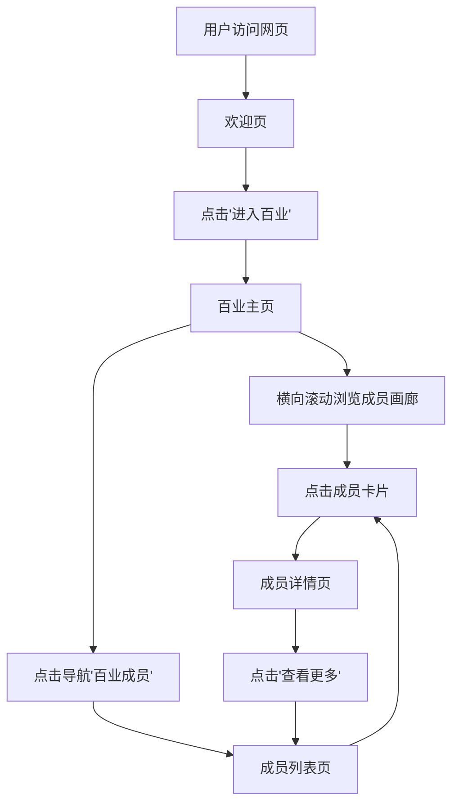

# 燕云十六声百业成员管理展示网页 - 产品需求文档

## 1. 产品概述
燕云十六声百业成员管理与展示网页，用于展示百业公会成员信息、角色定位和互动资料。
- 面向百业公会成员及关注者的展示型网页，支持成员浏览、详情查看和公会信息展示
- 采用武侠 noir 设计风格，营造沉浸式的游戏公会氛围

## 2. 核心功能

### 2.1 功能模块
1. **欢迎页**：沉浸式欢迎界面，展示公会品牌标识，引导用户进入百业主页
2. **百业主页**：核心成员展示页，包含旋转装饰环、中心徽章、底部横向滚动成员画廊
3. **成员列表页**：百业成员管理页，Bento 网格卡片布局，支持搜索/筛选/分页
4. **成员详情页**：3D 交互式成员档案卡，展示个人资料、角色、语录和统计数据

### 2.2 页面详情

| 页面名称 | 模块名称 | 功能描述 |
|----------|----------|----------|
| 欢迎页 | 品牌标识区 | 展示"燕云十六声"书法 Logo、"百业情意结"中心徽章、"进入百业"按钮 |
| 欢迎页 | 大气效果层 | 金色粒子动画、光芒放射效果、烟雾叠加层 |
| 欢迎页 | 旋转装饰环 | SVG 圆形路径文字动画，展示公会标语 |
| 百业主页 | 导航栏 | 毛玻璃效果顶部导航，包含"百业成员"、"照片墙"、"百业资料"、"加入我们" |
| 百业主页 | 主视觉区 | 全屏英雄区域，带视差滚动背景 |
| 百戽主页 | 成员画廊 | 底部横向滚动成员缩略图列表，支持左右箭头导航 |
| 成员列表页 | 成员网格 | 响应式 Bento 网格（2-5列），每张卡片包含角色图片、名称、职位标签 |
| 成员列表页 | 操作层 | 悬停显示编辑/删除按钮，点击卡片触发详情弹窗 |
| 成员列表页 | 分页器 | 底部分页导航，支持页码切换 |
| 成员详情页 | 3D 成员卡 | Three.js 3D 卡片交互，鼠标追踪旋转 + 光泽效果 |
| 成员详情页 | 个人信息 | 角色名、职位、个人语录、统计数据（排名/ karma/ valor） |
| 成员详情页 | 操作按钮 | 编辑按钮、查看更多按钮 |

## 3. 核心流程

用户访问网页 → 欢迎页（沉浸式品牌展示）→ 点击"进入百业" → 百业主页（浏览成员画廊）→ 点击成员卡片 → 成员详情页（3D 交互档案）

## 4. 用户界面设计

### 4.1 设计风格
- **主题**：Wuxia Noir（武侠黑色电影风格）
- **主色调**：
  - 墨黑背景 `#0d0e0f` / `#121414`
  - 暗金强调色 `#e9c176`（用于高价值信息、按钮、装饰）
  - 朱砂红 `#d35041`（用于重要标签、社主标识）
  - 灰白文字 `#e2e2e2` / `#c4c7c7`
- **字体**：
  - 标题字体：Noto Serif SC（衬线体，书法质感）
  - 正文字体：Hanken Grotesk（现代无衬线体）
  - 装饰字体：Ma Shan Zheng / Zhi Mang Xing（毛笔书法）
- **按钮风格**：直角/微圆角，金色渐变金属质感，悬停发光效果
- **布局**：固定导航栏 + 全屏英雄区 + 响应式网格
- **图标**：Material Symbols Outlined

### 4.2 页面设计概览

| 页面名称 | 模块名称 | UI 元素 |
|----------|----------|---------|
| 欢迎页 | 品牌标识 | 书法 Logo、金色分割线、旋转 SVG 文字环、白色圆形徽章、粒子动画 |
| 欢迎页 | 进入按钮 | 金色边框按钮，金属渐变背景，四角装饰线，悬停发光 |
| 百业主页 | 导航栏 | 毛玻璃半透明背景、金色下划线高亮当前页、通知/用户图标 |
| 百业主页 | 成员画廊 | 3:4 比例卡片、默认灰度/悬停彩色、底部渐变文字遮罩 |
| 成员列表页 | 成员卡片 | 3:4 竖版卡片、纸张纹理叠加、悬停上浮 + 边框高亮、操作按钮层 |
| 成员详情页 | 3D 卡片 | Three.js 渲染、鼠标追踪旋转、光泽着色器、底部毛玻璃名牌 |

### 4.3 响应式设计
- 桌面优先设计，最大宽度 1440px
- 移动端适配：边距缩减至 16px、多列网格堆叠为单列
- 触摸优化：横向画廊支持触摸滑动

### 4.4 大气效果
- **粒子系统**：金色粒子从底部升起，模拟萤火虫/光点
- **光芒效果**：锥形渐变光芒动画（god-rays）
- **烟雾层**：径向渐变叠加，创造聚光灯效果
- **纸张纹理**：低透明度碳纤维/自然纸纹理叠加
- **金属质感**：按钮和装饰使用线性渐变模拟金属反光
