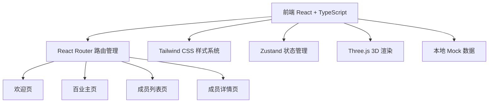

# 燕云十六声百业成员管理展示网页 - 技术架构文档

## 1. 架构设计



## 2. 技术说明

- **前端框架**：React 18 + TypeScript
- **构建工具**：Vite
- **样式方案**：Tailwind CSS 3（自定义 Wuxia Noir 设计令牌）
- **路由**：React Router v6
- **状态管理**：Zustand
- **3D 渲染**：Three.js（成员详情页 3D 卡片交互）
- **图标库**：lucide-react（替代 Material Symbols）
- **初始化工具**：vite-init
- **数据**：本地 Mock 数据（JSON），无需后端

## 3. 路由定义

| 路由 | 用途 |
|------|------|
| `/` | 欢迎页（沉浸式品牌展示） |
| `/home` | 百业主页（成员画廊 + 英雄区） |
| `/members` | 成员列表页（Bento 网格 + 分页） |
| `/member/:id` | 成员详情页（3D 卡片 + 个人档案） |

## 4. 项目结构

```
yysls/
├── src/
│   ├── components/         # 可复用组件
│   │   ├── Navbar.tsx      # 顶部导航栏
│   │   ├── MemberCard.tsx  # 成员卡片组件
│   │   ├── MemberGrid.tsx  # 成员网格布局
│   │   ├── Pagination.tsx  # 分页组件
│   │   ├── Particles.tsx   # 粒子动画效果
│   │   ├── GodRays.tsx     # 光芒效果
│   │   ├── RotatingRing.tsx # 旋转装饰环
│   │   ├── MemberDetailModal.tsx # 成员详情弹窗
│   │   └── Card3D.tsx      # Three.js 3D 卡片
│   ├── pages/              # 页面组件
│   │   ├── WelcomePage.tsx # 欢迎页
│   │   ├── HomePage.tsx    # 百业主页
│   │   ├── MembersPage.tsx # 成员列表页
│   │   └── MemberDetailPage.tsx # 成员详情页
│   ├── data/               # Mock 数据
│   │   └── members.ts      # 成员数据
│   ├── store/              # Zustand 状态
│   │   └── useStore.ts     # 全局状态
│   ├── styles/             # 全局样式
│   │   └── globals.css     # Tailwind 基础样式 + 自定义效果
│   ├── App.tsx             # 根组件 + 路由配置
│   └── main.tsx            # 入口文件
├── public/                 # 静态资源
├── tailwind.config.js      # Tailwind 配置（Wuxia Noir 设计令牌）
├── vite.config.ts
└── package.json
```

## 5. 设计令牌配置

### 5.1 颜色系统
| 令牌名称 | 色值 | 用途 |
|----------|------|------|
| `surface-lowest` | `#0d0e0f` | 最深背景层 |
| `surface` | `#121414` | 主背景 |
| `surface-container` | `#1e2020` | 卡片/面板背景 |
| `surface-high` | `#282a2b` | 悬浮层背景 |
| `secondary` | `#e9c176` | 暗金色强调 |
| `tertiary` | `#d35041` | 朱砂红 |
| `on-surface` | `#e2e2e2` | 主文字色 |
| `on-surface-variant` | `#c4c7c7` | 次要文字色 |
| `outline` | `#8e9192` | 边框色 |
| `outline-variant` | `#444748` | 弱化边框色 |

### 5.2 字体系统
| 令牌 | 字体族 | 大小 | 行高 |
|------|--------|------|------|
| `headline-xl` | Noto Serif SC | 48px | 1.2 |
| `headline-lg` | Noto Serif SC | 32px | 1.3 |
| `headline-md` | Noto Serif SC | 24px | 1.4 |
| `body-lg` | Hanken Grotesk | 18px | 1.6 |
| `body-md` | Hanken Grotesk | 16px | 1.6 |
| `label-sm` | Hanken Grotesk | 12px | 1.0 |

### 5.3 间距系统
基于 8px 基础单位：
- `base`: 8px
- `gutter`: 24px
- `margin-mobile`: 16px
- `margin-desktop`: 64px

## 6. 数据模型

### 6.1 成员数据结构

```typescript
interface Member {
  id: number;
  name: string;           // 游戏内名称
  role: string;           // 职位（社主/副社长/百业指挥/成员）
  title: string;          // 称号/昵称
  description: string;    // 个人语录
  avatarUrl: string;      // 头像图片 URL
  bannerUrl: string;      // 横幅图片 URL
  rank: string;           // 排名
  karma: number;          // karma 值
  valor: number;          // valor 值
  joinDate: string;       // 加入日期
  isVerified: boolean;    // 是否认证
}
```

### 6.2 Mock 成员数据

预设 10 名成员：
1. 泥丸蛋略 - 百业社主（朱砂红标签）
2. 月月有雨 - 副社长
3. 雾姬 - 副社长
4. 祈婉 - 百业指挥
5. 云暮溪泽 - 百业指挥
6. 迷糊小柒 - 百业指挥
7. 同人万歌 - 百业指挥
8. 姬无命 - 成员
9. 青竹幽香 - 百业指挥
10. 玉斯年 - 成员

## 7. 关键交互效果

### 7.1 欢迎页
- 金色粒子从底部缓慢升起（CSS @keyframes animation）
- 锥形光芒动画缓慢旋转（conic-gradient + animation）
- 白色圆形徽章带纸张纹理
- 进入按钮：金属渐变背景 + 悬停发光 + 四角装饰线

### 7.2 百业主页
- SVG 圆形路径文字 25 秒循环旋转
- 背景图片视差效果（mouseMove 追踪）
- 底部成员画廊支持横向滚动 + 左右箭头导航
- 成员卡片默认灰度，悬停恢复彩色

### 7.3 成员列表页
- Bento 网格响应式布局（2→3→4→5 列）
- 卡片悬停：上浮 + 边框高亮 + 操作按钮渐入
- 分页器：金色高亮当前页
- 顶部大气模糊光斑装饰

### 7.4 成员详情页
- Three.js 3D 卡片：鼠标追踪旋转 + 光泽着色器 + 边缘发光
- 毛玻璃名牌浮层
- 统计数据展示（排名/Karma/Valor）
